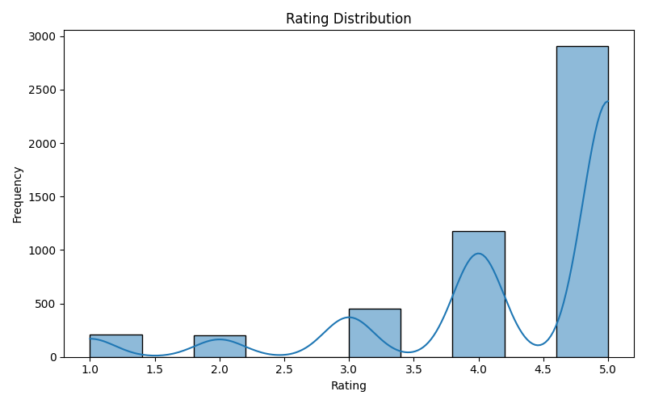
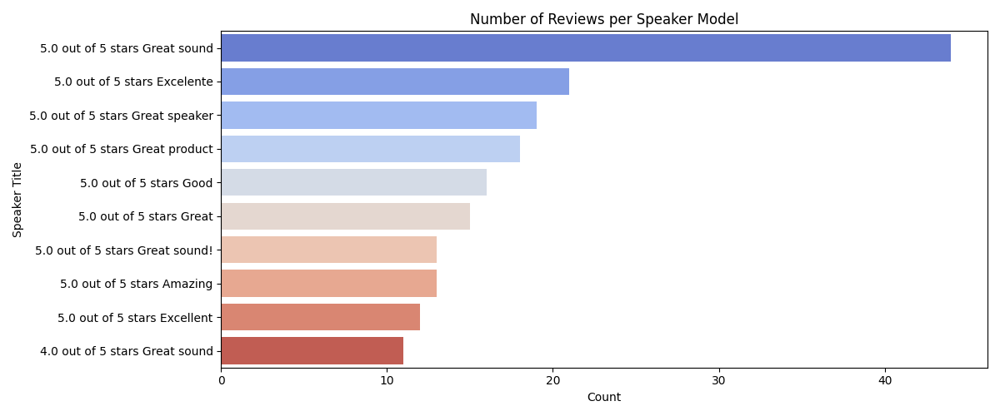
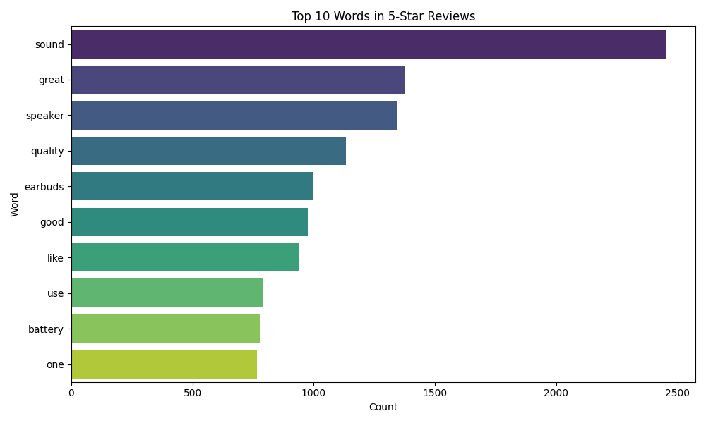
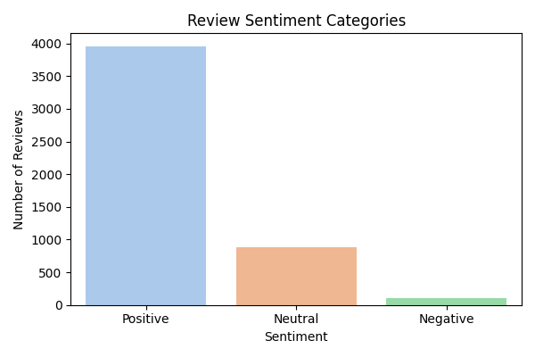
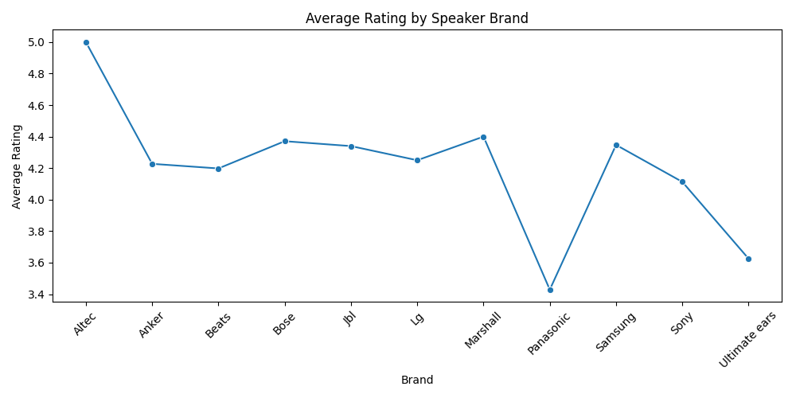

# 🎧 Beats by Dre – Wireless Speaker Consumer Insights (Externship)

**Role:** Data Analytics Extern | **Focus:** Survey + Amazon reviews → sentiment, EDA, strategy

---

## Executive Summary
Customers love **sound quality** and **value**; friction clusters around **battery life**, **connectivity**, and **durability**. Recommend an entry product at **$79–$99** and a core model at **$149–$179**, with marketing that leads on **sound + battery** and channels that prioritize **Amazon**.

---

## Data & Methods
- **Data:** Survey (n=20), Amazon reviews (thousands)  
- **Repo note:** To keep this repo lightweight, I included **sample subsets** of the large review datasets (`part01` only). The full datasets were used for analysis and are available upon request.
- **Tools:** Python (pandas, nltk, TextBlob), Matplotlib/Seaborn, React/TS for dashboard  
- **Tasks:** Cleaning, EDA, sentiment scoring (VADER/TextBlob), comparative analysis, storytelling

## 2) Project Structure
```
/data           → Cleaned datasets & survey responses
/notebooks      → Jupyter notebooks (EDA, sentiment, correlation)
/visuals        → All generated charts & word clouds
/dashboard      → Executive dashboard (React + TypeScript)
/docs           → Presentation deck & text summary reports
```
---

## What the Data Shows

**1) Ratings skew high, with a meaningful tail of friction**  


**2) Where the conversation is happening (models with the most reviews)**  


**3) What delights customers (language inside 5-star reviews)**  


**4) Positive sentiment dominates—but negatives flag real product issues**  


**5) Beats is competitive, but reliability/value win the category**  


---

## Recommendations

**Product**  
- Improve **battery life** and **Bluetooth stability**; ruggedize enclosure.  
- Two-tier pricing (Entry **$79–$99**, Core **$149–$179**) to compete with JBL/Anker while preserving premium feel.

**Marketing**  
- Lead with **sound + battery** value; amplify on **Amazon** with rich PDP content and review strategy.

**Customer Experience**  
- Tighten setup guidance, surface firmware updates, and reinforce warranty/durability commitments.

---

## Deliverables
- **Live Executive Dashboard:** 👉 [Open Dashboard](https://claude.ai/public/artifacts/5c27cc3c-9b86-4e2a-97fb-1cff99c99343?fullscreen=false)
- **Notebook:** `amazon_reviews_eda.ipynb`  
- **Deck:** `Consumer-Insights-Wireless-Speaker-Market (2).pptx`  
- **Datasets (Samples in Repo):**
  - `Final_Speaker_Reviews_Visualized_part01.csv`
  - `Cleaned_Speaker_Reviews_EDA_part01.csv`
  - `Cleaned  Wireless  Speakers Survey (Responses) - First 20 Responses (1).csv`

> To reproduce the full analysis locally, use the complete datasets. The notebook will run on the sample files for demonstration (subset) or on the full data for full fidelity.
