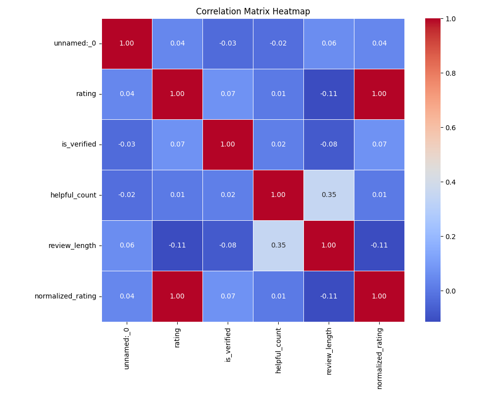
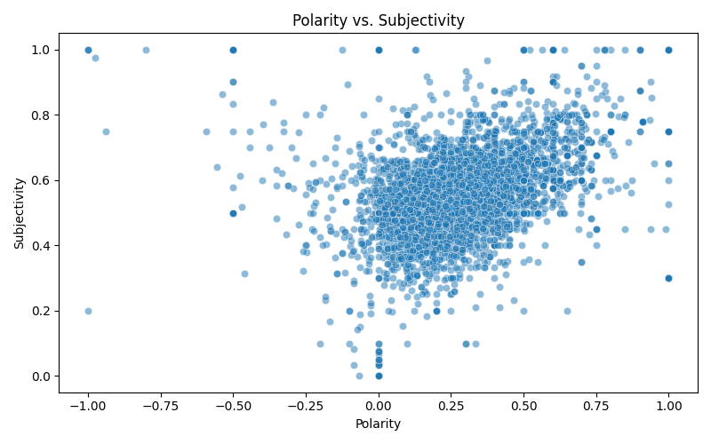
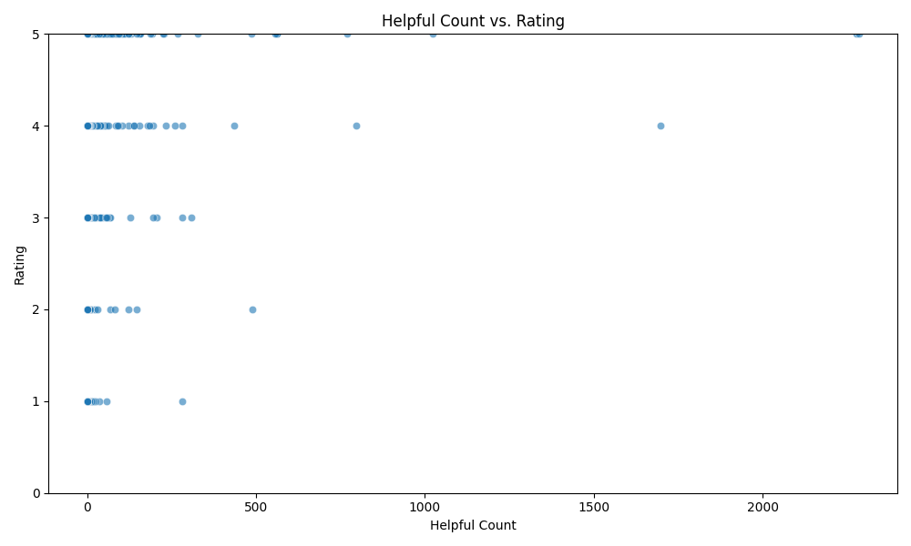
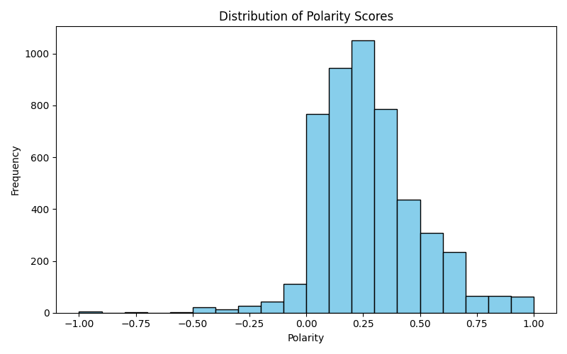
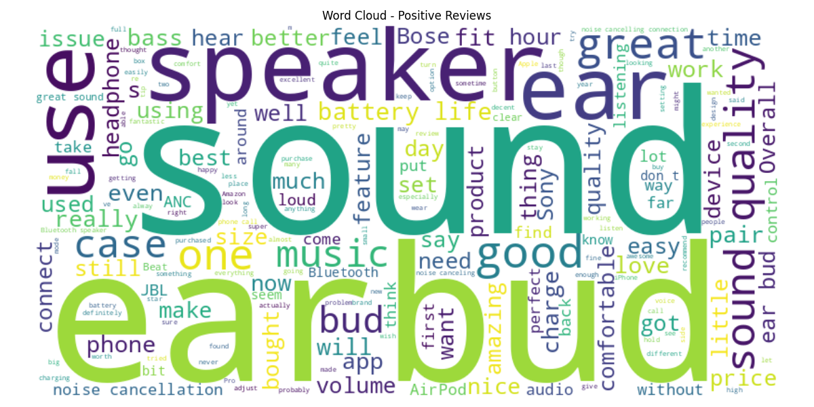
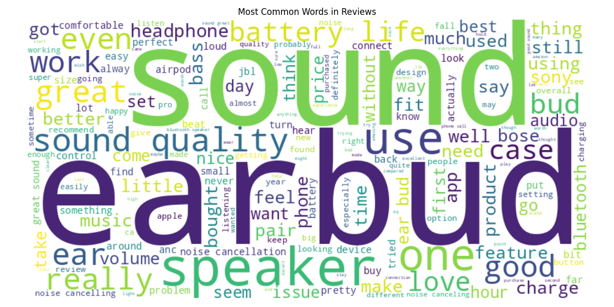

# 🎧 Beats by Dre – Wireless Speaker Consumer Insights (Externship)

**Role:** Data Analytics Extern | **Focus:** Survey + Amazon reviews → sentiment, EDA, strategy

---

## Executive Summary
Customers love **sound quality** and **value**; friction clusters around **battery life**, **connectivity**, and **durability**. Recommend an entry product at **$79–$99** and a core model at **$149–$179**, with marketing that leads on **sound + battery** and channels that prioritize **Amazon**.

---

## Data & Methods
- **Data:** Survey (n=20), Amazon reviews (thousands)  
- **Repo note:** To keep this repo lightweight, I included **sample subsets** of the large review datasets (`part01` only). The full datasets were used for analysis and are available upon request.
- **Tools:** Python (pandas, nltk, TextBlob), Matplotlib/Seaborn, React/TS for dashboard  
- **Tasks:** Cleaning, EDA, sentiment scoring (VADER/TextBlob), comparative analysis, storytelling

## Project Structure
```
/data           → Cleaned datasets & survey responses
/notebooks      → Jupyter notebooks (EDA, sentiment, correlation)
/visuals        → All generated charts & word clouds
/dashboard      → Executive dashboard (React + TypeScript)
/docs           → Presentation deck & text summary reports
```
---

## 📊 What the Data Shows

**1) Ratings skew high, with a meaningful tail of friction**  
  
*Most customers leave 4–5 star ratings, suggesting overall satisfaction, but a noticeable cluster of low scores signals recurring issues that can’t be ignored.*

**2) Where the conversation is happening (models with the most reviews)**  
  
*Certain models dominate the conversation, which means their performance and reputation heavily influence the brand’s public image.*

**3) What delights customers (language inside 5-star reviews)**  
  
*In glowing reviews, “sound” and “quality” are the top recurring terms, reinforcing that audio performance is Beats’ strongest competitive edge.*

**4) Positive sentiment dominates—but negatives flag real product issues**  
  
*While positive sentiment is the majority, neutral and negative categories highlight opportunities to address concerns like battery life and durability.*

**5) Beats is competitive, but reliability/value win the category**  
  
*Beats’ average ratings are strong, but brands like Bose and JBL sometimes lead in perceived reliability and value, especially in mid-tier price ranges.*

---

## 📊 Extra Visuals – Deep Dive Insights

---

### Part A – Relationship Analysis  
4. **Correlation Heatmap**  
     
   *Visualizes correlations between review metrics, uncovering which factors tend to move together.*

5. **Polarity vs Subjectivity**  
     
   *Plots sentiment polarity against subjectivity, showing how emotional versus factual reviews tend to rate.*

6. **Helpful Count vs Rating**  
     
   *Examines whether high-rated reviews are also considered most helpful by other customers.*

---

### Part B – Sentiment & Keywords  
7. **Sentiment Histogram (Alt)**  
     
   *Breaks down the distribution of positive, negative, and neutral sentiments in the reviews.*

8. **Positive Review Word Cloud**  
     
   *Highlights the most common words in positive reviews, giving a quick glance at what customers love.*

9. **All Reviews Word Cloud**  
     
   *A broad word cloud of all reviews, capturing the full spectrum of customer discussion topics.*


---

## Recommendations

**Product**  
- Improve **battery life** and **Bluetooth stability**; ruggedize enclosure.  
- Two-tier pricing (Entry **$79–$99**, Core **$149–$179**) to compete with JBL/Anker while preserving premium feel.

**Marketing**  
- Lead with **sound + battery** value; amplify on **Amazon** with rich PDP content and review strategy.

**Customer Experience**  
- Tighten setup guidance, surface firmware updates, and reinforce warranty/durability commitments.

---
## Main Analysis Highlights
1. **Sentiment Distribution** – Categorized reviews as Positive, Neutral, or Negative using TextBlob and VADER sentiment analysis.
2. **Brand Ratings** – Compared average ratings across major speaker brands.
3. **Top Words in Reviews** – Identified common keywords in 5-star reviews to understand what drives positive feedback.
4. **Rating Patterns** – Analyzed the distribution of ratings to spot trends in customer satisfaction.

---

## Deliverables

### **Live Dashboard**
- [Beats Executive Dashboard](https://claude.ai/public/artifacts/5c27cc3c-9b86-4e2a-97fb-1cff99c99343?fullscreen=false)

### **Notebooks**
- [Amazon Reviews EDA](./amazon_reviews_eda.ipynb)
- [Gemini Speaker Review Insights](./Gemini_Speaker_Review_Insights_WITH_KEY.ipynb)
- [Speaker Review Correlation Analysis](./Speaker_Review_Correlation_Analysis.ipynb)

- **Datasets:**  
  [Final_Speaker_Reviews_Visualized_part01.csv](./Final_Speaker_Reviews_Visualized_part01.csv)  
  [Cleaned_Speaker_Reviews_EDA_part01.csv](./Cleaned_Speaker_Reviews_EDA_part01.csv)  
  [Cleaned  Wireless  Speakers Survey (Responses) - First 20 Responses (1).csv](./Cleaned%20%20Wireless%20%20Speakers%20Survey%20(Responses)%20-%20First%2020%20Responses%20(1).csv)

> To reproduce the full analysis locally, use the complete datasets. The notebook will run on the sample files for demonstration (subset) or on the full data for full fidelity.
