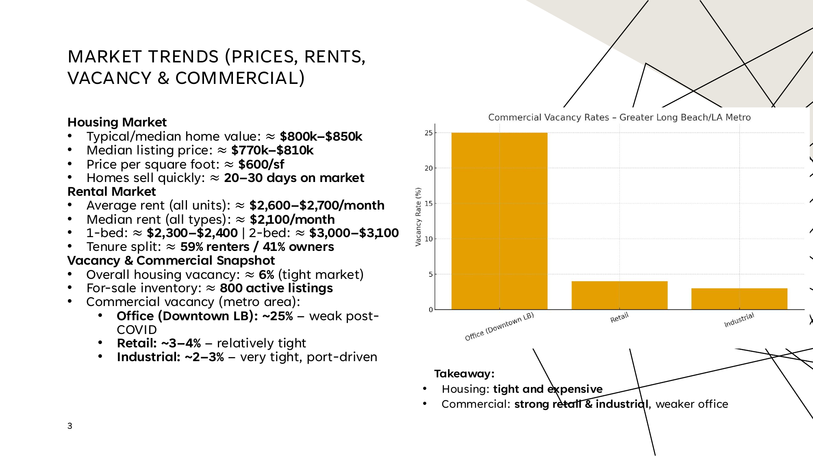
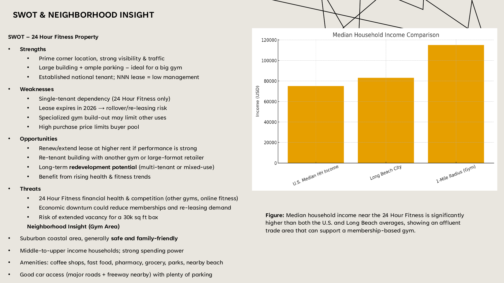
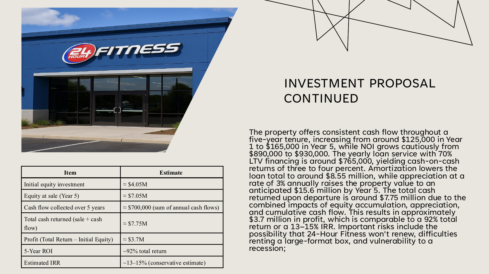

# Commercial Real Estate Investment Analysis

## Project Files
- [View full investment presentation](./commercial-real-estate-investment-analysis.pdf)

## Overview
I evaluated the acquisition potential of a 30,070 sq ft 24 Hour Fitness property in the Long Beach / Orange County market. The goal was to look beyond the asking price and understand whether the property had enough market demand, cash flow stability, and redevelopment upside to justify the investment.

This project combines market research, demographic analysis, commercial real estate fundamentals, and a 5-year investment forecast.

## Business Question
Would this property be a strong long-term investment after considering tenant risk, lease rollover, market demand, and potential exit returns?

## Project Flow
1. Reviewed the Long Beach / Orange County market and local demand drivers.
2. Compared housing, rental, office, retail, and industrial vacancy trends.
3. Evaluated the subject property's location, traffic, tenant profile, and lease structure.
4. Built a 5-year investment forecast using NOI, debt service, appreciation, and exit value assumptions.
5. Developed an investment recommendation based on risk and return.

## Key Numbers
| Metric | Result |
|---|---:|
| Building Size | ~30,070 sq ft |
| Asking Price | ~$13.5M |
| Cap Rate | ~6.4%-6.6% |
| Trade Area Population | 134,000+ residents within 3 miles |
| Daily Traffic Exposure | ~46,000 vehicles/day |
| Median Household Income Within 1 Mile | ~$115,000 |
| Projected Year 5 Property Value | ~$15.6M |
| Estimated 5-Year ROI | ~92% |
| Estimated IRR | ~13%-15% |
| Estimated Profit at Exit | ~$3.7M |

## Key Findings
- The property sits in a strong trade area with high income levels, strong visibility, and enough population density to support a fitness or wellness concept.
- Retail vacancy was only about 3%-4%, while industrial vacancy was about 2%-3%. That told me the market was much stronger for service-based and logistics-supported real estate than traditional office space.
- Office vacancy was above 25%, which made me more cautious about repositioning the property toward office use.
- The 2026 lease expiration is a real risk, but it also creates a value-add opportunity if the property can be re-tenanted or redeveloped into a higher-use format.

## Recommendation
I would recommend pursuing the investment only under a value-add strategy, not as a passive hold.

The best strategy would be to:
1. Keep the existing NNN lease cash flow in the short term.
2. Begin planning for lease rollover before the 2026 expiration.
3. Evaluate backup uses such as another fitness operator, wellness/medical users, multi-tenant retail, or mixed-use redevelopment.
4. Use the strong traffic count and high-income trade area to support future leasing or redevelopment negotiations.

## Project Visuals & Insights

*Commercial vacancy and market trend analysis used to compare office, retail, and industrial demand conditions in the Long Beach market.*

*SWOT analysis evaluating lease rollover risk, redevelopment flexibility, and long-term market positioning.*

*5-year investment forecast showing projected ROI, IRR, equity growth, and exit valuation scenarios.*

## Conclusion
My conclusion was that the property had attractive upside, but the investment depended heavily on execution after the lease expiration. The numbers looked strong on paper, with an estimated 92% 5-year ROI and 13%-15% IRR, but the real value was in the property's location, land size, and redevelopment flexibility.

## Skills Demonstrated
- Market Research
- Financial Modeling
- Forecasting
- ROI and IRR Analysis
- Commercial Real Estate Analysis
- Risk Assessment
- Strategic Recommendation Development
