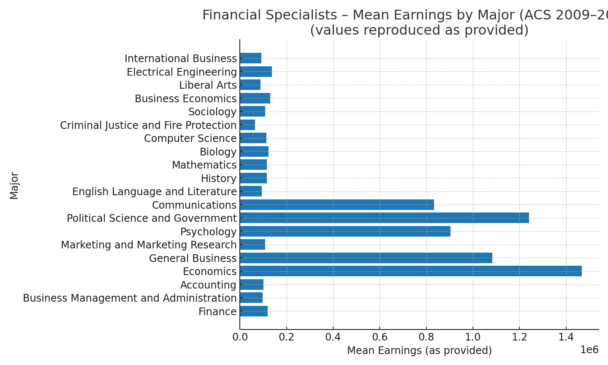

# 📈 Earnings Analysis of Financial Specialists by Undergraduate Major

**Research question:** Do **Economics** majors working as *Financial Specialists* earn more than peers from other majors?  
**Data:** American Community Survey (ACS), pooled **2009–2013**, filtered to **Financial Specialists (occ1990 = 25)**, earnings inflation-adjusted to constant dollars.

---

## Summary
Using ACS microdata, I compare earnings among Financial Specialists across the 20 most common undergraduate majors. I first present **descriptive comparisons** (means/medians), then estimate OLS models:

- **Short model:** `EARNINGS ~ ECON` (difference-in-means as a regression)  
- **Long model:** `EARNINGS ~ ECON + FEMALE` (reduces omitted-variable bias from gender)  
- **Auxiliary model:** `FEMALE ~ ECON` (to quantify omitted-variable bias, OVB)

Key takeaway: the raw difference suggests Economics majors earn more; including **FEMALE** improves fit and reduces bias. These are *adjusted descriptive* results; adding more controls (age/experience, industry, metro, race/ethnicity, education) would further reduce bias.

---

## Table 1 — Top Majors Among Financial Specialists (ACS 2009–2013)

> Reproduced from the paper (a few values include trailing digits exactly as provided). A downloadable CSV is in `/outputs/earnings_by_major_desc.csv`.

| Major | Freq | Cumulative % | Mean | Median |
|---|---:|---:|---:|---:|
| Finance | 2840 | 18.0 | 118,820 | 81,378 |
| Business Management and Administration | 1846 | 11.7 | 97,377 | 70,370 |
| Accounting | 1574 | 9.9 | 101,878 | 75,735 |
| Economics | 1258 | 7.9 | 146,7464 | 93,577 |
| General Business | 1160 | 7.3 | 108,4093 | 75,396 |
| Marketing and Marketing Research | 481 | 3.0 | 108,533 | 70,370 |
| Psychology | 441 | 2.8 | 90,3626 | 60,317 |
| Political Science and Government | 419 | 2.6 | 124,1466 | 79,393 |
| Communications | 327 | 2.0 | 83,3104 | 59,545 |
| English Language and Literature | 281 | 1.72 | 93,858 | 68,778 |
| History | 274 | 1.71 | 116,278 | 69,469 |
| Mathematics | 265 | 1.6 | 115,537 | 80,410 |
| Biology | 184 | 1.1 | 123,249 | 76,199 |
| Computer Science | 168 | 1.0 | 113,087 | 75,396 |
| Criminal Justice and Fire Protection | 166 | 1.0 | 65,120 | 50,264 |
| Sociology | 150 | 0.95 | 109,181 | 56,567 |
| Business Economics | 135 | 0.85 | 129,604 | 79,574 |
| Liberal Arts | 126 | 0.8 | 89,208 | 63,197 |
| Electrical Engineering | 124 | 0.7 | 136,732 | 90,476 |
| International Business | 118 | 0.71 | 92,769 | 64,084 |

---

## Figure: Mean Earnings by Major
> Bar chart generated from the descriptive table above (values reproduced exactly as provided).

---

## Models & Exact Regression Results (embedded)

We estimate:

- **Short model:** `EARNINGSᵢ = α + β·ECONᵢ + eᵢ`  
- **Long model:** `EARNINGSᵢ = α + β·ECONᵢ + γ·FEMALEᵢ + eᵢ`  
- **Auxiliary:** `FEMALEᵢ = π₀ + π₁·ECONᵢ + uᵢ`  

From the paper:

- **Short model**: α = **122,928.7000**, β(ECON) = **42,804.0000**, R² = **0.0094**.  
- **Long model**: β(ECON) decreases by **6,902.7000** to **35,901.3000**; γ(FEMALE) = **−63,619.3200**; R² = **0.0628**.  
- **Auxiliary**: π₁(ECON→FEMALE) = **−0.1085**, implying **OVB ≈ γ·π₁ = 6,902.7000**.

### Table 2 — OLS Results (exact values from paper)

| Model | Intercept (α) | ECON (β) | FEMALE (γ) | R² |
|---|---:|---:|---:|---:|
| Short: `EARNINGS ~ ECON` | 122,928.7000 | 42,804.0000 | — | 0.0094 |
| Long: `EARNINGS ~ ECON + FEMALE` | — | 35,901.3000 | −63,619.3200 | 0.0628 |
| Auxiliary: `FEMALE ~ ECON` | — | π₁(ECON) = −0.1085 | — | — |

**Interpretation.** The short model indicates Economics majors in Financial Specialist roles earn about **$42.8k** more than non-Econ peers on average, but this is **biased** because it ignores gender composition. Adding **FEMALE** in the long model reduces the Econ coefficient by **$6.9k** to **$35.9k** and increases **R² from 0.0094 to 0.0628**. The auxiliary regression shows Econ majors are **10.85 pp less likely to be female** (π₁ = −0.1085); multiplying by the female effect (γ = −63.6k) reproduces the observed **OVB ≈ $6.9k**, confirming part of the short-model gap reflects composition differences.

---

## Reproducible Code (R)
A cleaned version of the analysis is in [`code/earnings_analysis_clean.R`](code/earnings_analysis_clean.R).  
Your **original** classroom script is preserved in [`docs/Financial_Specialists_script09_original.R`](docs/Financial_Specialists_script09_original.R).

---

## Downloads
- **Full Term Paper (DOCX):** [`docs/Econ_103A_Term_Paper.docx`](docs/Econ_103A_Term_Paper.docx)  
- **Regression Results (PDF):** [`docs/Regression_Results.pdf`](docs/Regression_Results.pdf)  
- **Descriptive Table (CSV):** [`outputs/earnings_by_major_desc.csv`](outputs/earnings_by_major_desc.csv)  
- **Figure — Mean Earnings by Major (PNG):** [`outputs/mean_earnings_by_major.png`](outputs/mean_earnings_by_major.png)
